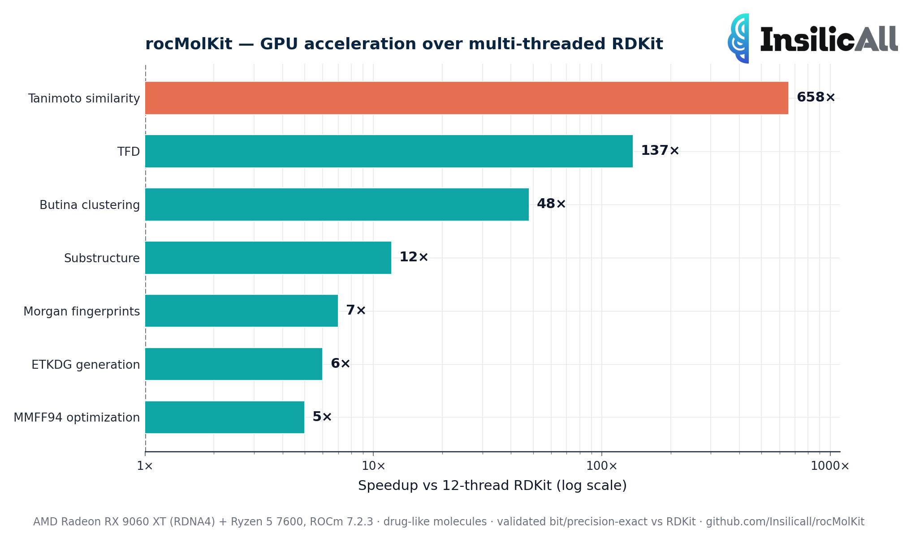

# rocMolKit

[](https://github.com/Insilicall/rocMolKit/actions/workflows/ci.yml)
[](LICENSE)

**GPU-accelerated conformer generation and force-field optimization for RDKit, on AMD GPUs** — via HIP/ROCm.

HIP/ROCm port of [nvMolKit](https://github.com/NVIDIA-Digital-Bio/nvMolKit) (NVIDIA CUDA, Apache 2.0) — same API surface, AMD backend. On a **consumer** Radeon RX 9060 XT it runs ETKDG conformer generation and MMFF94 optimization **~5–6× faster than 12-thread RDKit** (and ~12–13× vs single-core), at 100% success and RDKit-validated geometry — out-leading the published Apple-Silicon sibling ports ([guillaume-osmo](https://github.com/guillaume-osmo/mlxmolkit), [shivampatel10](https://github.com/shivampatel10/mlxmolkit)) in conformers/s on the same molecule sizes.

> **Status: beta.** All core modules are ported to HIP and validated against
> RDKit on AMD RDNA4 / gfx1200: **ETKDG** generation and **MMFF94** optimization
> (see Performance), plus **UFF**, **batched forcefield**, **conformer RMSD**,
> **Morgan fingerprints** (bit-exact), **Tanimoto/Cosine similarity** (bit-exact),
> **Butina clustering** (matches RDKit; high-cutoff differences are valid
> parallel tie-breaks), **substructure search** (840/840 vs RDKit) and **TFD**
> (float32 precision). Per-feature porting notes and validators in
> [PLAN.md](PLAN.md); see also [ISSUES.md](ISSUES.md), [CHANGELOG.md](CHANGELOG.md).

## Performance



Measured on an **AMD Radeon RX 9060 XT** (Navi 44, gfx1200, RDNA4, 32 CUs) +
Ryzen 5 7600, ROCm 7.2.3. **All numbers are at 100% success and
RDKit-validated**: the generated conformers fall in the *same* MMFF energy
basins as RDKit (median ΔE = 0.00 kcal/mol; 52/60 drug-like molecules within
1 kcal/mol of RDKit's best conformer). It is not speed producing garbage — it is
speed producing the same result RDKit produces.

Throughput scales strongly with molecule size (MMFF is O(n²) in the non-bonded
terms), so we report both regimes — conformers per second, higher is better:

| Workload | small molecules (~12 atoms) | drug-like (~30 atoms, +H) |
|---|---|---|
| **ETKDG generation** (DG + ETK) | **~29,000** | **~4,900** |
| **MMFF94 optimization** (fresh) | **~31,500** | **~4,900** |

### vs RDKit — same machine, same molecules (the clean comparison)

| drug-like | rocMolKit | RDKit 1-core | RDKit 12-thread |
|---|---|---|---|
| ETKDG generation | **~4,900** | 395 (**12×**) | 865 (**5.7×**) |
| MMFF94 optimize | **~4,900** | 375 (**13×**) | 907 (**5.4×**) |

### vs the Apple-Silicon sibling ports (their published numbers; different hardware)

Both ports validate against RDKit, so "RDKit-quality conformers/s" is the shared,
fair unit. Hardware differs (Apple M3 Max ~14 TFLOPS FP32 vs RX 9060 XT
~25.6 TFLOPS FP32) — read it as "each port on the accelerator it targets."

| same molecule size | rocMolKit | mlxmolkit | rocMolKit lead |
|---|---|---|---|
| ETKDG gen, drug-like, k=10 | ~4,900 | 2,625 ([guillaume-osmo](https://github.com/guillaume-osmo/mlxmolkit)) | **~1.9×** |
| full pipeline (+MMFF), k=10 | ~2,450 | 1,473 (guillaume-osmo) | **~1.7×** |
| MMFF optimize, ~12–14 atoms | ~31,500 | ~12,000 ([shivampatel10](https://github.com/shivampatel10/mlxmolkit)) | **~2.6×** |

Full methodology and the root-cause write-ups are in [docs/PERFORMANCE_HIP.md](docs/PERFORMANCE_HIP.md).

Reproduce:

```bash
python3 tools/etkdg_bench.py 1000 4     # ETKDG generation, N=1000 molecules × k=4 conformers
python3 tools/mmff_fresh.py  1000 4     # MMFF94 optimization, fresh conformers
```

### Building blocks (fingerprints, similarity, substructure, TFD, clustering)

GPU vs RDKit CPU on the same host, measured at scale where the GPU saturates
(throughput grows with batch size while the CPU stays flat). Speedups are GPU
vs single-core / vs 12-thread RDKit.

| Operation | Scale | **rocMolKit (GPU)** | RDKit (1 core) | RDKit (12 threads) | Speedup |
|---|---|---|---|---|---|
| **Morgan fingerprints** | 500k mols | **1.5M mol/s** | 96k | 216k | **16× / 7×** |
| **Tanimoto similarity** | 10k × 10k | **10B pair/s** | 16M | 15M | **645× / 658×** |
| **Substructure** | 50k × 29 | **4.7M pair/s** | 1.2M | 393k | **3.9× / 12×** |
| **TFD** | 1000 mols × 10 conf | **8.4M pair/s** | 68k | 61k | **123× / 137×** |
| **Butina clustering** | 8k mols | **274k mol/s** | 5.6k | 5.6k | **49× / 48×** |

- The O(N²) operations (similarity, clustering) leave multi-threaded RDKit
  furthest behind; RDKit's `BulkTanimotoSimilarity` / `GetTFDMatrix` / Butina are
  effectively single-threaded (the 1-core and 12-thread columns match), so the
  GPU lead widens with N.
- **Substructure** handles any SMARTS, including recursive (`[$(...)]`). Large
  target sets are chunked internally and GPU memory is released between chunks,
  so a single call scales to any number of targets without exhausting the device
  (the throughput above is for the simple-SMARTS, all-pairs case).

```bash
python3 tools/bench_features.py         # the table above, GPU vs RDKit 1-core / 12-thread
```

## Quickstart

Run on a ROCm-capable machine with the prebuilt dev image:

```bash
docker run --rm -it \
    --device=/dev/kfd --device=/dev/dri \
    --group-add video --security-opt seccomp=unconfined \
    ghcr.io/insilicall/rocmolkit:devel \
    python3
```

```python
from rdkit import Chem
from rdkit.Chem import AddHs
from rdkit.Chem.rdDistGeom import ETKDGv3
from rocmolkit._embedMolecules import EmbedMolecules, BatchHardwareOptions
from rocmolkit._mmffOptimization import MMFFOptimizeMoleculesConfs

mols = [AddHs(Chem.MolFromSmiles(s)) for s in
        ("CCO", "c1ccccc1", "CC(=O)O", "CC(C)Cc1ccc(cc1)C(C)C(=O)O")]
params = ETKDGv3()
params.useRandomCoords = True

opts = BatchHardwareOptions()
opts.gpuIds = [0]                 # pin to the discrete GPU — see note below

EmbedMolecules(mols, params, 50, -1, opts)        # 50 conformers per molecule
MMFFOptimizeMoleculesConfs(mols, 200, [], opts)   # MMFF94, maxIters=200
```

> **Pin `gpuIds=[0]`** on Ryzen hosts. Such systems enumerate both an integrated
> GPU (gfx1036) and the discrete GPU; dispatching to the iGPU crashes. Pinning to
> the discrete device avoids it. (The earlier "non-deterministic SIGSEGV" was this
> deterministic iGPU dispatch — see [ISSUES.md](ISSUES.md) "ROOT CAUSE FOUND".)

## Hardware

ROCm 6.2+ on one of:

| GPU | gfx | Status |
|---|---|---|
| RX 9060 XT / RDNA4 | gfx1200 | primary (validated) |
| RX 7900 XTX/XT | gfx1100 | supported |
| MI210 / MI250 | gfx90a | supported |
| MI300 | gfx942 | supported |
| RX 6000 series | gfx1030 | use `HSA_OVERRIDE_GFX_VERSION=10.3.0` |

## Build

```bash
# Minimal production image (< 2 GB)
docker build -f docker/Dockerfile.slim -t rocmolkit:slim .

# Dev image with the ROCm SDK (hipcc, gdb, hipify)
docker build -f docker/Dockerfile.devel -t rocmolkit:devel .

# Local build
cmake -S . -B build -GNinja -DGPU_TARGETS=gfx1200
cmake --build build
```

## Testing

Two layers. The smoke/safe tests are pure Python and need no GPU; the feature
tests are marked `gpu` and validate the GPU result against RDKit on hardware.

```bash
# No GPU: import + package self-consistency (what public CI runs)
pytest tests/ -m "not gpu"

# On a ROCm machine: also run the GPU feature suite (fingerprints, similarity,
# Butina clustering, TFD — each compared bit/precision-exact against RDKit)
pytest tests/ --rocm
```

`tests/test_gpu_features.py` is the integration suite; each test `importorskip`s
its binding, so anything not built is skipped rather than failing. The same
checks also exist as standalone scripts under `tools/` (`fp_validate.py`,
`sim_validate.py`, `butina_validate.py`, `tfd_validate.py`) for ad-hoc runs.

### Validate the published image on your GPU

Pull the image and run the GPU suite against the **bindings installed in the
image** (this checkout supplies only the test files + data). GPU passthrough,
plus a writable `/tmp` for comgr's JIT blit kernels:

```bash
docker run --rm \
    --device=/dev/kfd --device=/dev/dri \
    --group-add video --group-add render --security-opt seccomp=unconfined \
    -e HIP_VISIBLE_DEVICES=0 -v "$PWD":/work -w /tmp \
    ghcr.io/insilicall/rocmolkit:devel \
    python3 -m pytest /work/tests --rocm -v
```

`-w /tmp` (not `/work`) keeps the source tree off `sys.path`, so `import
rocmolkit` resolves to the version baked into the image — you test the published
artifact, not the local checkout. The convenience wrapper does the pull for you:

```bash
bash tools/test_image.sh                # :devel
bash tools/test_image.sh v0.4.1-devel   # a specific tag
ROCMOLKIT_NO_PULL=1 bash tools/test_image.sh   # reuse the local image
```

## Continuous integration

Public CI (`.github/workflows/ci.yml`) runs on PR open / reopen / ready — **not**
on every push to an open PR — plus tag pushes and manual dispatch. It builds
`rocmolkit_core`, the bindings, and the devel/slim images, and runs the non-GPU
tests. The GPU suite needs an AMD GPU, so it is run on demand on a ROCm machine —
see [Testing](#testing) above.

### Publishing images

`.github/workflows/docker.yml` builds and pushes `ghcr.io/insilicall/rocmolkit:{devel,slim}`
on `v*` tag pushes. To refresh them with the latest bindings, tag a release
(`git tag vX.Y.Z && git push --tags`). To publish by hand:

```bash
docker build -f docker/Dockerfile.devel -t ghcr.io/insilicall/rocmolkit:devel .
echo "$GHCR_TOKEN" | docker login ghcr.io -u <user> --password-stdin
docker push ghcr.io/insilicall/rocmolkit:devel
```

## How it works

rocMolKit runs the full ETKDG pipeline (DistGeom 4D → ETK 3D → chirality/stereo
checks) and MMFF94 optimization on the GPU, with an in-kernel batched BFGS
minimizer (one warp per conformer, inverse Hessian in global memory). Conformers
are the unit of parallel work, so throughput scales with both the molecule count
(N) and conformers per molecule (k). See [docs/PERFORMANCE_HIP.md](docs/PERFORMANCE_HIP.md)
for the architecture and the optimization history.

## Roadmap

Core modules are ported and validated (ETKDG, MMFF94, UFF, batched forcefield,
conformer RMSD, fingerprints, similarity, Butina clustering, substructure, TFD).
See [PLAN.md](PLAN.md).

## License

Apache 2.0. See [LICENSE](LICENSE) and [NOTICE](NOTICE) for attribution to the
upstream nvMolKit.
